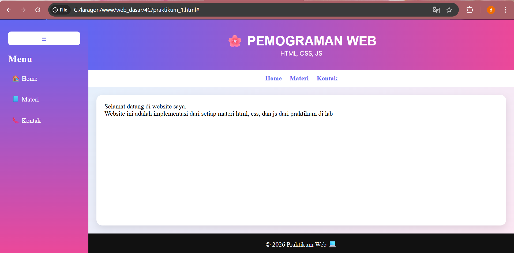
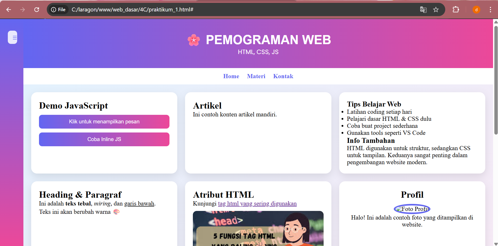
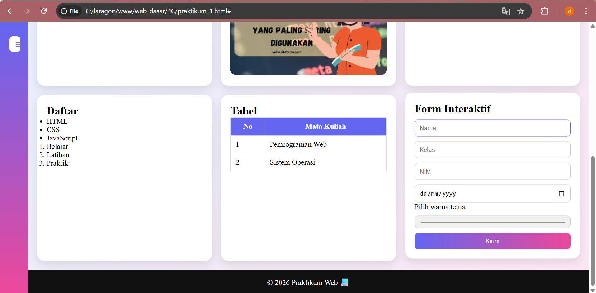
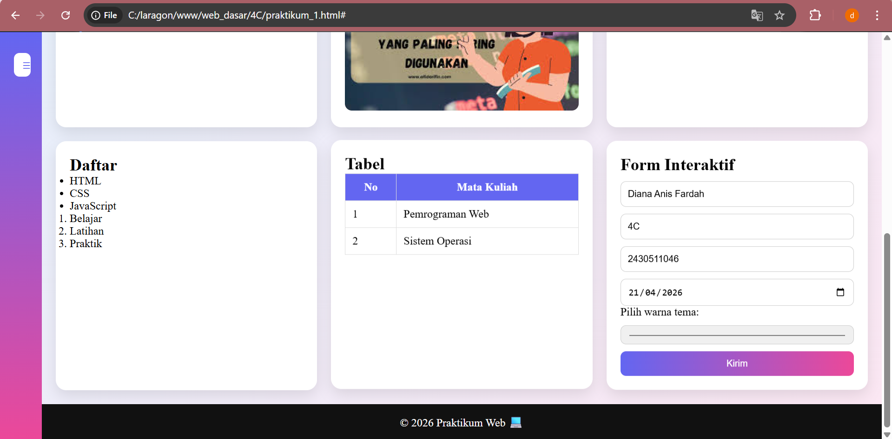
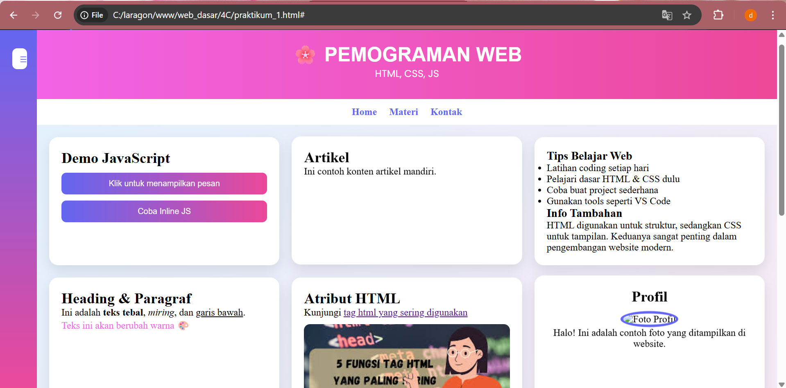
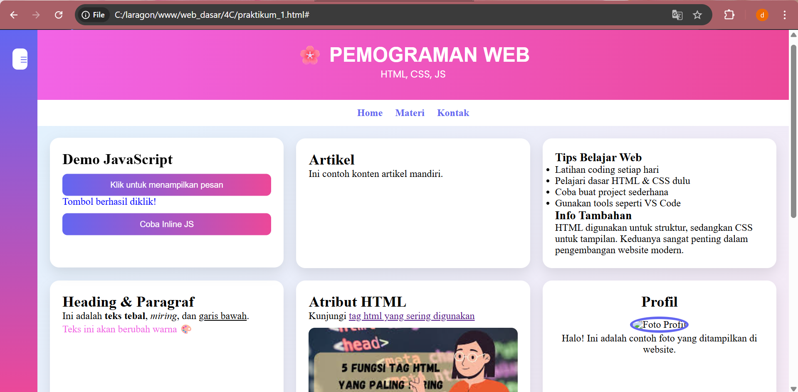
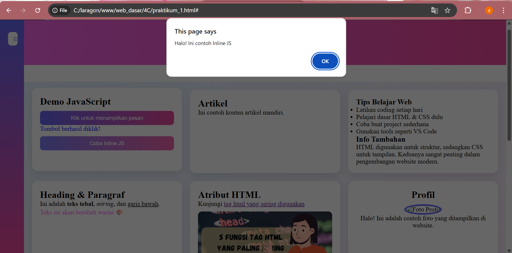
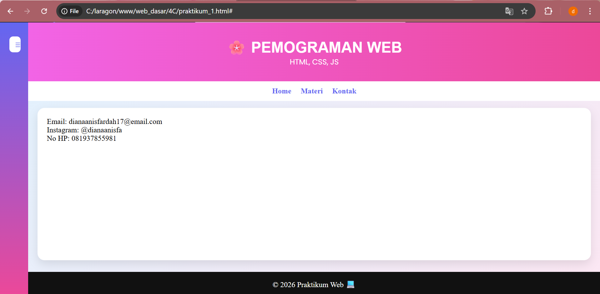

# 🌸 Web Dasar - Praktikum Pemrograman Web
Project ini merupakan hasil praktikum Pemrograman Web Dasar yang berisi implementasi dasar dari HTML, CSS, dan JavaScript. Melalui project ini kita bisa memahami bagaimana cara membuat website, mengenal struktur dan tag HTML, mengetahui styling menggunakan CSS, dan interaksi menggunakan JavaScript.

# 📌 Deskripsi
Website ini dibuat sebagai latihan untuk memahami:
    - Struktur halaman menggunakan HTML
    - Styling menggunakan CSS
    - Interaktivitas menggunakan JavaScript
Website memiliki beberapa halaman utama:
    1. Home → Halaman sambutan
    2. Materi → Berisi berbagai demo dan contoh elemen web
    3. Kontak → Informasi kontak pembuat

# 🚀 Fitur Utama
1. Navigasi Interaktif
Navigasi menggunakan navbar dan sidebar. Perpindahan halaman dilakukan tanpa reload dengan JavaScript
2. Sidebar Toggle
    - Sidebar bisa dibuka/tutup dengan tombol
    - Layout otomatis menyesuaikan
3. Demo JavaScript
    - Tombol untuk menampilkan pesan
    - Contoh penggunaan inline JS
    - Event click dan manipulasi DOM 
4. Form Interaktif
    - Input nama, kelas, NIM, tanggal
    - Validasi sederhana: Nama tidak boleh kosong    minimal 3 karakter 
5. Warna Dinamis
    - User bisa memilih warna tema
    - Warna header berubah otomatis
6. Konten HTML Lengkap
    - Heading & paragraf
    - List (ul & ol)
    - Tabel
    - Gambar
    - Link
    - Form
  Semua ditampilkan di halaman materi 

# 🎨 Tampilan (CSS)
Menggunakan background gradasi, layout berbasis card, grid responsif, sidebar modern, serta efek hover. Seluruh tampilan diatur dalam file CSS.

# 🛠️ Teknologi yang Digunakan
    - HTML5
    - CSS3
    - JavaScript 

# 📂 Struktur Folder
web_dasar/
│── praktikum_1.html
│── style.css
│── script.js
│── images.jpg

# ▶️ Cara Menjalankan
1. Clone repository:
    ```bash
    git clone https://github.com/dianaanisfardah17-ship-it/web-dasar-diana.git
    ```
2. Masuk ke folder project:
    ```bash
    cd web-dasar-diana
    ```
3. Jalankan file di browser:
    ```
    praktikum_1.html
    ```
(di browser)

# Dokumentasi Website









👤 Author
Nama: Diana Anis Fardah
Email: [dianaanisfardah17@email.com](mailto:dianaanisfardah17@email.com)

📌 Catatan
Project ini dibuat untuk keperluan pembelajaran dan praktikum, sehingga masih dapat dikembangkan lebih lanjut.

✨ Selamat belajar dan eksplorasi web development!