# 🌸 Praktikum Pemrograman Web Dasar

## 📌 Deskripsi

Project ini adalah website sederhana berbasis **HTML, CSS, JavaScript, dan PHP** yang dibuat sebagai implementasi hasil praktikum pemrograman web.

Website ini menggabungkan:

* Tampilan UI modern (gradient + card layout)
* Navigasi dinamis tanpa reload
* Interaksi JavaScript (DOM)
* Form input yang terhubung ke backend PHP

Struktur halaman utama dapat dilihat pada file HTML  yang terdiri dari:

* Sidebar
* Header
* Navbar
* Main content (Home, Materi, Kontak)

---

## 🎯 Tujuan Project

* Mengimplementasikan materi HTML, CSS, dan JavaScript
* Memahami konsep interaksi DOM
* Menghubungkan form ke backend (PHP)
* Membuat UI sederhana tapi interaktif

---

## 🧩 Struktur Halaman

### 1. 🏠 Home

Berisi:

* Sambutan pengguna
* Deskripsi singkat project

➡️ Fungsi:
Sebagai halaman utama (default saat pertama dibuka)

---

### 2. 📘 Materi (Bagian Inti Project)

bagian materi berisi implementasi dari semua materi praktikum.

#### Isi Materi:

✅ **1. Demo JavaScript**

* Tombol menampilkan pesan
* Inline JavaScript (alert)
* Manipulasi DOM

Contoh:

```js
hasil.textContent = "web ini adalah tugas praktikum pemograman web!";
```

---

✅ **2. Artikel & Aside**

* Artikel sederhana
* Tips belajar web
* Informasi tambahan HTML & CSS

---

✅ **3. Heading & Paragraf**

* Teks tebal, miring, garis bawah
* Teks dengan warna dinamis (`#teksWarna`)

---

✅ **4. Atribut HTML**

* Link eksternal (target="_blank")
* Gambar (`img`)

---

✅ **5. List**

* Unordered list (ul)
* Ordered list (ol)

---

✅ **6. Tabel**

* Data mata kuliah statis

---

✅ **7. Form Interaktif (Core Feature)**
Form ini adalah bagian paling penting karena menghubungkan frontend ke backend.

Field:

* Nama
* Kelas
* NIM
* Tanggal
* Nilai
* Email
* Mata kuliah
* Warna tema

Form mengarah ke:

```html
<form method="POST" action="proses.php">
```

---

### 3. 📞 Kontak

Berisi:

* Email
* Instagram
* Nomor HP

---

## ⚙️ Fitur Interaktif

### 🔹 1. Navigasi Tanpa Reload

Menggunakan JavaScript untuk berpindah antar section:

```js
showSection(homeSection);
```

➡️ Semua section disembunyikan lalu ditampilkan sesuai klik


---

### 🔹 2. Sidebar Toggle (UX Feature)

* Bisa collapse / expand
* Mengubah layout body (`shift` & `shift-collapsed`)

```js
sidebar.classList.toggle("collapsed");
```

---

### 🔹 3. Validasi Form (Client-side)

Validasi nama:

* Tidak boleh kosong
* Minimal 3 karakter

```js
if (nama === "") { ... }
```

---

### 🔹 4. Interaksi Warna Real-time

User bisa memilih warna diform input dan teks di demo javasript akan berubah sesuai dengan warna yang diinput.

```js
targetText.style.color = e.target.value;
```

---

## 📤 Proses Setelah Form Dikirim
Setelah user mengisi form lalu menekan tombol **Kirim**, data tidak langsung hilang, tetapi diproses oleh file `proses.php`.

Alurnya:

1. User mengisi form di `index.html`
2. Form dikirim menggunakan method `POST` ke file `proses.php`
3. `proses.php` mengambil data dari form 
4. Data dibersihkan menggunakan fungsi :
```
function bersihkanInput($data) {
    return htmlspecialchars(trim($data));
}
```
5. Sistem melakukan validasi
6. Sistem menentukan kelulusan berdasarkan nilai
7. Data disimpan ke session (selama user di sesi website), cookie (menyimpan nama user dan warna sementara), database MySQL melalui query INSERT INTO users;
8. Setelah berhasil, masuk ke halaman proses.php 

## Halaman Proses PHP
halaman ini menampilkan:
 - Pesan bahwa data berhasil dikirim
 - Tabel ringkasan data user
 - Status lulus/tidak lulus
 - Informasi session dan cookie
 - Ringkasan data seperti total user, status NIM ganjil/genap, jadwal kelas, dan panjang nama
 - implementasi PHP : bagian ini merupakan hasil kode yang ditulis langsung di file `proses.php`. tujuannya untuk latihan dasar PHP (variabel, percabangan, operator matematika, array). nilai yang ditampilkan disini bukan dari input user, tapi dari kode yang ditulis di VS Code. Sehingga bagian ini berfungsi sebagai media latihan untuk memahami cara kerja PHP di sisi backend.

## 📊 Halaman Data User
Tombol 📊 Lihat Data User di halaman proses PHP akan membuka file `data.php`. menampilkan seluruh data yang sudah tersimpan di database dalam bentuk tabel. selain itu, halaman ini memiliki fitur filter data berdasarkan status (semua, lulus, tidak lulus)

## 🎨 Desain & UI (CSS)

Menggunakan:

* **Gradient background**
* **Card layout**
* **CSS Grid**
* **Sidebar fixed**

Contoh:

```css
background: linear-gradient(135deg, #e0f2fe, #fce7f3);
```

Fitur UI:

* Hover effect card
* Responsive grid
* Sidebar modern
* Form styling rapi

---

## 🔗 Alur Sistem
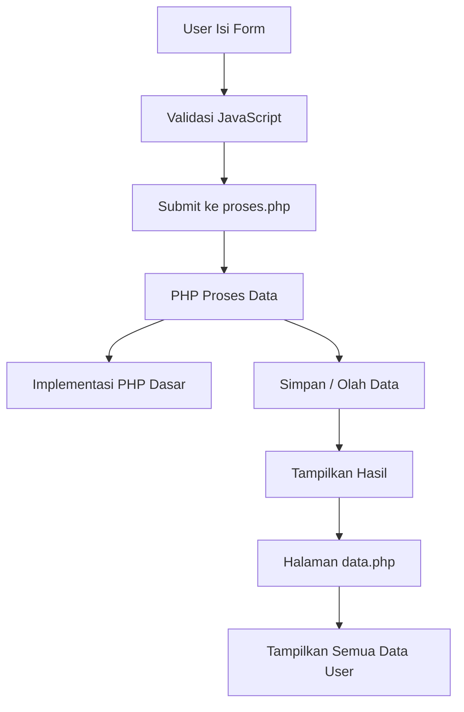

---

## 🗂️ Struktur File

```
project/
│
├── index.html      # Halaman utama
├── style.css       # Tampilan UI
├── script.js       # Interaksi & logic JS
├── koneksi.php     # Koneksi database
├── proses.php      # Proses form
├── data.php        # tampil data
```

---

## 🛠️ Teknologi

### Frontend

* HTML5
* CSS3 (Grid, Flexbox)
* JavaScript (Vanilla)

### Backend

* PHP

---

## ▶️ Cara Menjalankan

1. Install XAMPP / Laragon
2. Letakkan project ke:

   ```
   C:\laragon\www\web_dasar\4C
   ```
3. Jalankan Laragon/XAMPP
4. Akses:

   ```
   http://localhost/web_dasar/4C/
   ```

---

## 📌 Kelebihan Project

✅ Sudah menggunakan:

* Struktur HTML modern (section, article, aside)
* DOM manipulation
* Event handling
* Validasi form
* UI responsif
* Sidebar interaktif

---

## Dokumentasi Website
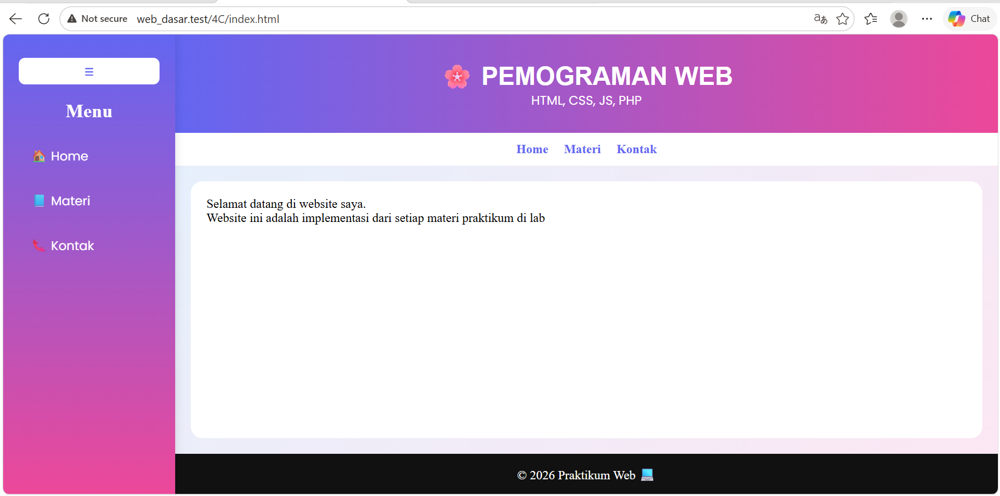
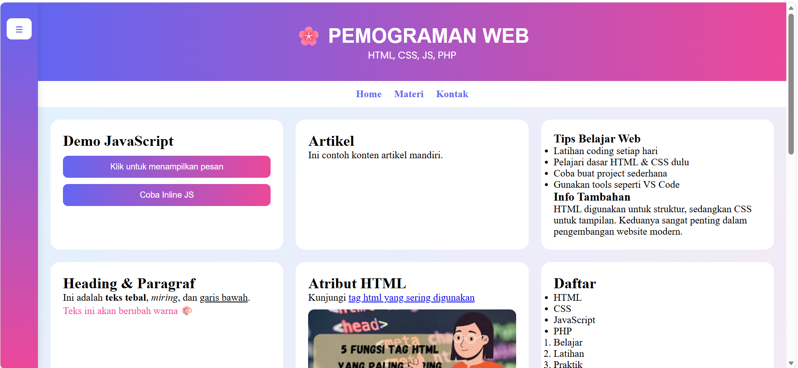
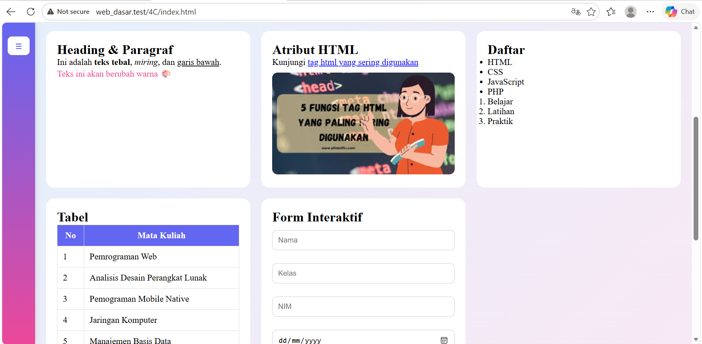
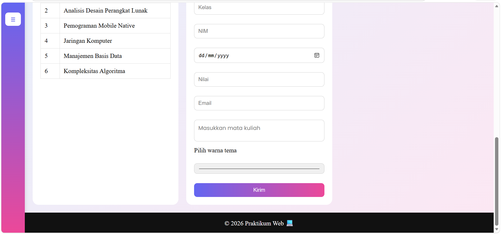
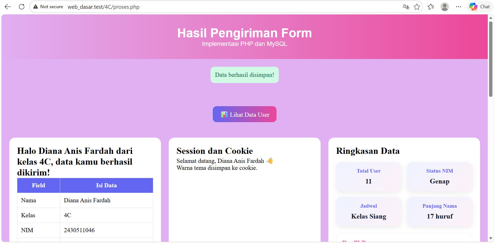
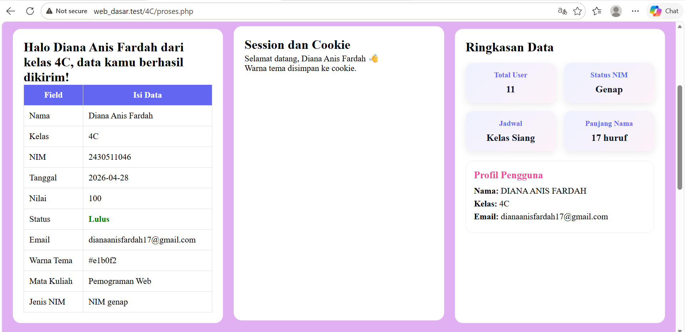
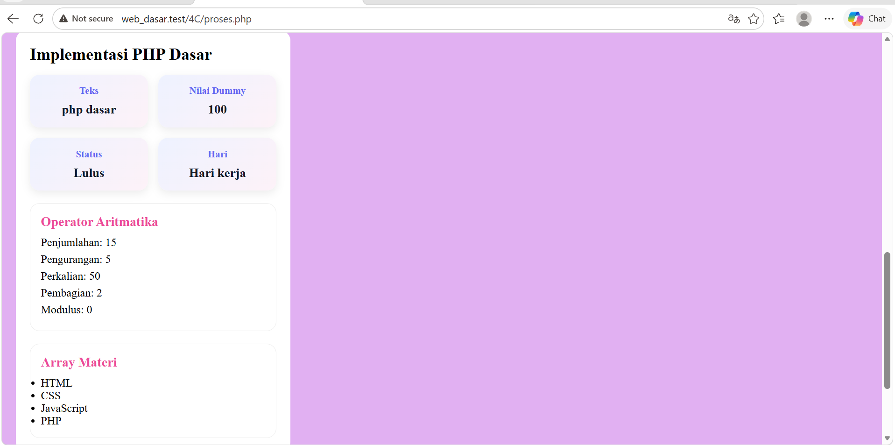
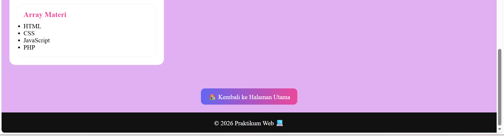
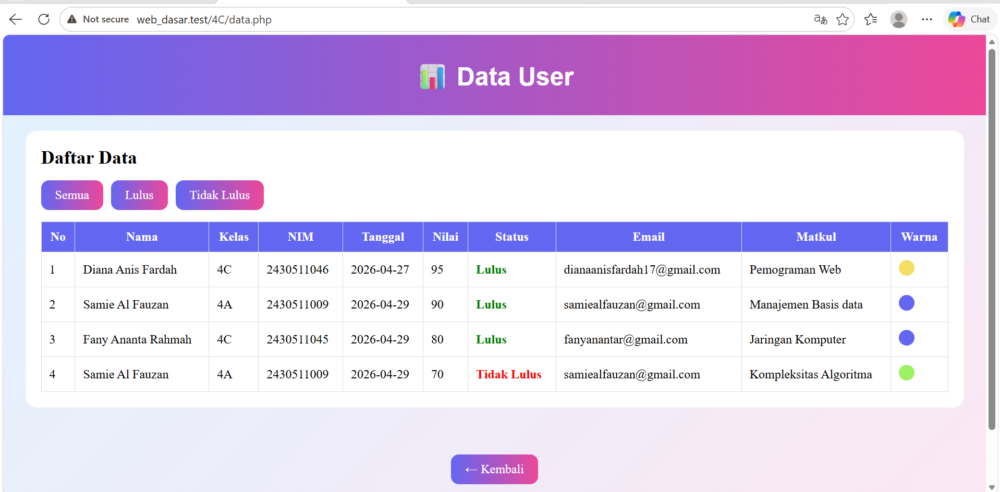
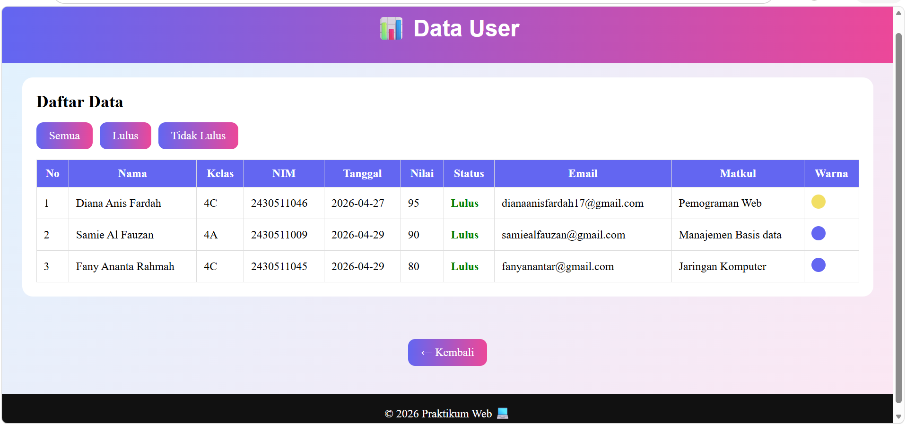


## 📝 Kesimpulan

Project ini bukan hanya latihan tampilan, tetapi sudah:

* Menggunakan interaksi JavaScript
* Menghubungkan frontend dan backend
* Memiliki struktur aplikasi web sederhana

Bagian **Materi** berfungsi sebagai Dokumentasi pembelajaran, Demo fitur, Implementasi langsung konsep web

---